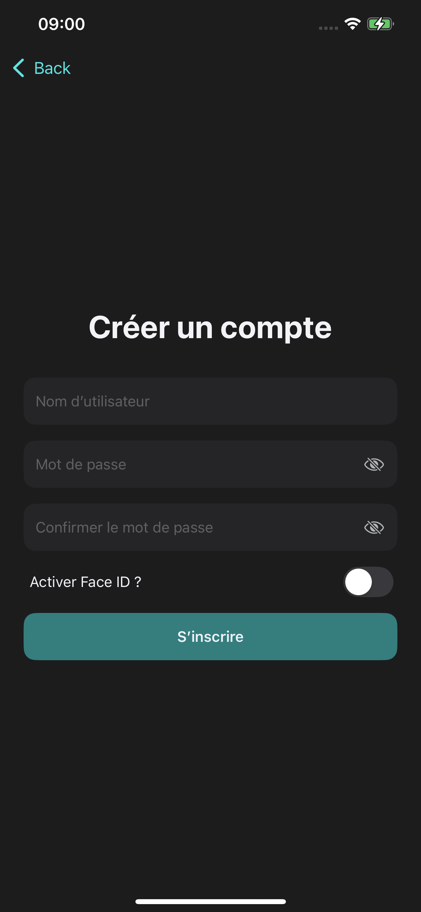
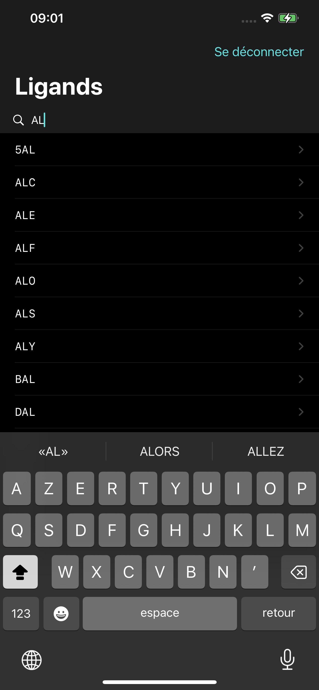
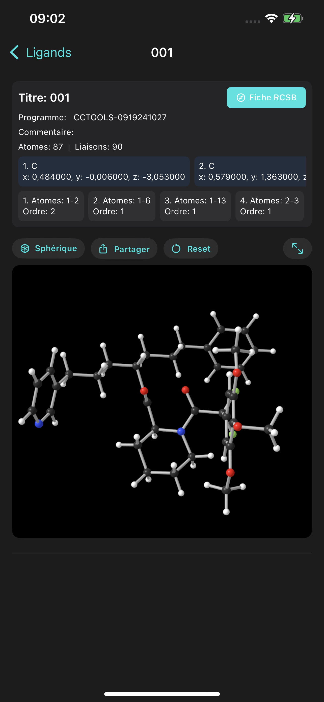
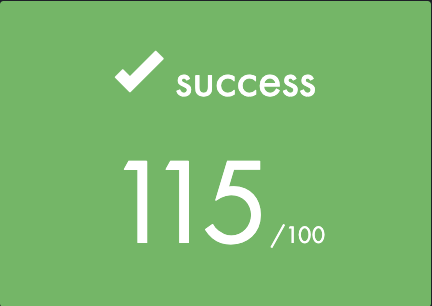

# Swifty Proteins

Application iOS d'exploration de ligands en 3D (SceneKit) avec authentification locale et fonctionnalités mobiles courantes.  

 

## Sommaire
- [Objectifs du projet](#objectifs-du-projet)
- [Installation & environnement](#installation--environnement)
- [Fonctionnalités principales](#fonctionnalités-principales)
- [Bonus implémentés](#bonus-implémentés)
- [Détails d'implémentation (fichiers et composants)](#détails-dimplémentation-fichiers-et-composants)
- [Captures d'écrans](#captures-décrans)

 

## Objectifs du projet
Le projet vise à :
- maîtriser le rendu 3D mobile (SceneKit),
- implémenter l'API biométrique (TouchID/FaceID),
- proposer le partage social d'une vue 3D,
- fournir une barre de recherche sur la liste des ligands,
- manipuler et visualiser des fichiers moléculaires (SDF/PDB) et comprendre les bases de biochimie nécessaires.

 

## Installation & environnement
- Plateforme : iOS
- Langage : Swift (Xcode + SwiftData)
- Ouvrir `Swifty Proteins.xcodeproj` dans Xcode et lancer l'app sur simulateur ou appareil réel.
- Le projet embarque `ligands.txt` donné par le sujet, et un dossier `Static/all_ligands` contenant tout les fichiers `.sdf` pour chaque ligands mentionnés dans le .txt (pour fallback si RCSB indisponible).

 

## Fonctionnalités principales
- Ecran de lancement et icône conforme au thème.
- Ecran d'authentification affiché systématiquement au lancement.
- Inscription et connexion par mot de passe.
- Authentification biométrique (FaceID/TouchID) optionnelle et sécurisée via Keychain.
- Liste des ligands (chargée depuis `Static/ligands.txt`) avec barre de recherche.
- Chargement prioritaire des fichiers SDF depuis le serveur RCSB, fallback sur `Static/all_ligands`.
- Parseur SDF pour construire la structure moléculaire utilisable en 3D.
- Vue 3D balls-and-sticks (`SceneKit`) avec [Coloration CPK](https://fr.wikipedia.org/wiki/Code_de_couleurs_CPK).
- Tooltip d'atome au tap, partage d'image PNG du rendu 3D.
- Protection de confidentialité : masquage en background et auto-logout.

 

## Bonus implémentés

- 3 modèles d'affichage :
	- Balls-and-sticks  
	- Wireframe (seulement les liaisons entre atomes)  
	- Space-filling  
- Light/Dark mode adaptatif  
- Watermark de l'application lors de partage  
- Ajout de lien vers documentation du ligand selectionné en Websheet vers RCSB  
- Propriétés en détail de chaque atome au clic  
- Ajout de lien vers documentation de chaque atome selectionné en Websheet vers Wikipedia  
- Compatibilité iPhone, iPad, MacOS et Apple Vision  
- Fichiers `.sdf` embarqués pour mode Offline (et fallback si site RCSB indisponible)  

 

## Détails d'implémentation (fichiers et composants)
Nous listons ici les composants clés et le rôle de chaque fichier important du repository.

- `swifty_proteinsApp.swift` : point d'entrée. Initialise le container SwiftData pour `UserAccount`, lance `RootView`, gère le cycle de vie et le bootstrap via `AppState`.

 

- Core & AppState
	- `Core/AppState.swift` : singleton local de l'état applicatif. Initialise `AuthStore` avec le `ModelContext`, observe les changements de session et propage les notifications via `FeedbackCenter`.
	- `Core/StartupCleanup.swift` : nettoyage des fichiers temporaires à la prochaine exécution si nécessaire.

 

- Modèles de données
	- `Models/Models.swift` : définit `@Model UserAccount` (username unique, salt, passwordHash, createdAt, biometricsEnabled) et `Session`.
	- `Stores/AccountsStore.swift` : CRUD SwiftData pour `UserAccount` (fetch, insert, update, delete, deleteAll).

 

- Authentification
	- `Auth/AuthRepository.swift` : implémente `AuthRepositing`. Orchestration entre `AccountsStore`, `CryptoService`, `KeychainService` et `BiometricsService`.
		- `createAccount(username:password:enableBiometrics:)` : génère un sel (`CryptoService.randomBytes`), calcule un hash (via `CryptoService.hash`), insère dans `AccountsStore`. Si biométrie activée, enregistre un secret dans le `KeychainService` protégé par policy biométrique.
		- `authenticateWithPassword(username:password:)` : récupère `UserAccount`, re-hache le mot de passe et compare, retourne `Session` si OK.
		- `authenticateWithBiometrics(username:)` : utilise `KeychainService.loadSecret` (ceci lance la prompt biométrique), valide et retourne `Session`.
		- `setBiometrics(username:enabled:)`, `changePassword`, `deleteAccount`, `purgeAll` : utilitaires pour gérer les comptes.
	- `Auth/AuthStore.swift` : couche observable (MainActor). Appelle `AuthRepository` et publie `session` et `lastError` pour l'UI. Gère la logique de présentation d'erreurs et les conversions d'erreurs en messages utilisateur.

 

- Services de sécurité
	- `Security/SecurityServices.swift` :
		- `CryptoService` (CryptoKit) : génération de bytes aléatoires et fonctions de hash (itérations paramétrables).
		- `KeychainService` : wrapper pour sauvegarder/charger des secrets avec `SecAccessControl` (prise en charge de la biométrie). Gestion des erreurs Keychain.
		- `BiometricsService` : wrapper `LocalAuthentication` pour détecter si la biométrie est disponible.

 

- UI & Composants
	- `Components/AuthTextField.swift` : champ réutilisable pour login/mot de passe (gère secure text, focus, labels, toggles).
	- `Components/Feedback.swift` : `FeedbackCenter` pour afficher des bannières d'information (success / error). `FeedbackBanner` et `feedbackOverlay`.
	- `Components/SafariSheet.swift` : wrapper `SFSafariViewController` pour ouvrir la documentation externe.
	- `Components/LigandsList.swift` : ligne simple de la liste (nom du ligand).

 

- Liste et parsing des ligands
	- `Data/LigandsListLoader.swift` : charge `ligands.txt` depuis le bundle (fallback Documents).
	- `Data/LigandFetcher.swift` (`SDFRepository`) :
		- `fetchLigand(id:)` tente d'abord `fetchFromRemote` (RCSB), puis `fetchFromBundle` si le remote échoue.
		- Gestion des erreurs réseau et des erreurs SDF via `SDFError` (notFound, network, invalidData, parse).
	- `Data/LigandParser.swift` (`SDFParser`) : parseur SDF qui découpe les blocs `$$$$`, parse counts line, atom lines et bond lines pour produire `LigandData`.

 

- Rendu 3D & utilitaires
	- `UI/Geometry.swift` (`GeometryFactory`) : fonctions pour créer nodes SCN représentant atomes et liaisons. Supporte deux styles (`GeometryStyle.sphere` et `.cube`). Calcule offsets pour que les cylindres (liaisons) ne traversent pas les sphères.
	- `UI/Ligand3DView.swift` : vues SwiftUI qui intègrent la `UIViewRepresentable` SceneKit (`Ligand3DSceneView`), UI pour sélectionner un atome, partager l'image (PNG + watermark), afficher en plein écran, etc.
	- `UI/LigandHeader.swift` : composants de UI montrant les propriétés de la molécule, chips pour atomes/liaisons.
	- `Data/PeriodicData.swift` (`PeriodicTable`) : singleton mappant symboles -> `ElementInfo` (symbol, name, cpk UIColor, radiusScale). Utilisé par `GeometryFactory` pour la coloration et l'échelle.

 

## Flux d'exécution (high-level)
1. Lancement de l'app : `swifty_proteinsApp` démarre, `RootView` démarre `AppState.bootstrap(context:)`.
2. `AppState` instancie `AuthStore` avec le `ModelContext` et expose `auth` dans l'environnement.
3. L'écran d'authentification (`LoginView`) est affiché tant que `auth.session == nil`.
4. Après login réussi, `HomeView` affiche la liste des ligands chargée par `LigandsViewModel` via `LigandsLoader`.
5. L'utilisateur sélectionne un ligand -> `LigandDetailView` appelle `LigandDetailViewModel.load(id:)` qui utilise `SDFRepository.fetchLigandDetailed(id:)`.
6. Le fichier SDF est parsé par `SDFParser` pour produire `LigandData` ; les molécules sont présentées en 3D via `Ligand3DSceneView`.

 

## Captures d'écrans

### Startup Screen

	
	

---

 

### Login / Signup

	
	
	

---

 

### Liste des ligands + recherche

	
	

---

 

### Vue 3D (balls-and-sticks)

	
	
	
	
	
	
	
	
	

 

---

### Export/Partage

	

 
 

## Grade

 

Ce projet est publié sous les termes de la [42 Unlicense](https://github.com/gcamerli/42unlicense).
